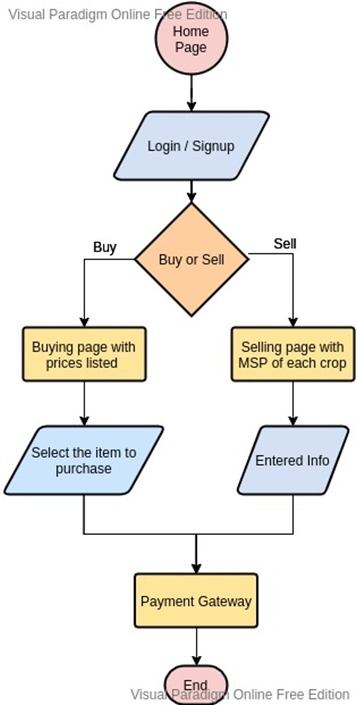

<h1 align='center'>Khet Market</h1>

**Khet Market** is a web-app through which farmers can sell crops to and buy equipment directly from other merchants without any third-party mediation.To avoid price inflation and maintain regularized selling, the app validates any purchase through the use of MSP for pricing and the buyer must adhere to it.The app also incorporates image integration for crops so the buyer can decide whether to proceed with the transaction.The app also incorporate payment authentication which help both parties avoid extra middleman costs and helps in creating of a completely self – independent virtual market space to empower both the buyer and seller.

### Flowchart

<p align='center'></p>

### Sections

These are the main pages of our web app along with the description.

1. **Home Page** - This is the home page of our application. It details all the utilities our app provides.

2. **Login** - This page lets the registered user to login into his/her dashboard.

3. **Register** - The user can register himself/herself by filling out the appropriate choices and details asked for the verification. We have integrated a minimum character limit to rule out vague and ambigious details.

4. **BuyOrSell** - This page acts as a gateway and provides the user to choice between buying goods and selling crops and redirects them to the appropriate page.

5. **Buy**: In this section, we designed an E-commerce kind of front-end where a farmer can purchase farming products like seeds, fertilizers, tractors, etc.

6. **Checkout** - This is the landing page after the user has selected his items and proceed further to review the items they added in the basket.

7. **Payment** - Here, the user can fill the details for completing the transaction.

8. **Orders** - This page helps the user to review their purchased items along with their unique order ids, address, and costs.

9. **Sell** - Here we have enforced the farmer to sell his/her crops above Minimum Support Price(MSP). Through the use of MSP, we are making farmers aware of the true market value for their goods and help them in creating a stronger negotiating position for themselves.

10. **Selling Item** - This page helps the user review their sold crops along with their addresses, type of the crop,and price asked for it.

### Pre-requisites required to run the application

1. **NodeJs**
2. Working **Firebase** account

### Steps to download and setup pre-requisites for our app

1. Download Nodejs - For downloading **nodejs** goto this [link](https://nodejs.org/en/download/).
2. Now goto [firebase](https://firebase.google.com/). Login to firebase with your google account.
3. Goto **console** and click on **Add Project**.
4. Enter the name of the project and all the required information and proceed.
5. Your project will be created on firebase.
6. Now on the dashboard, click on web icon. It will register the app in your project. Now enter all the necessary information about your app and click **create**.
7. Now your app is added to the project.
8. Goto **Firestore Database**. Click on **Create Database**. Then click on **Start in Test Mode** and keep all the information by default.
9. Goto **Authentication**. Click on **Get Started**. Now hover on **Email/Password** and click the pencil icon(edit icon). Enable the method and click **Save**.
10. Now, next to **Project Overview**, click on Settings icon and click **Project Settings**.
11. Scroll to the bottom of the settings page. In **Your apps** section, under **Firebase SDK snippet**, click on **Config**. Now copy the contents of **FirebaseConfig** and paste it somewhere.

### Steps to setup in the local system

1. Clone this repository - ```git clone https://github.com/pranjals149/Khet-Market.git```
2. Move into the cloned repository - ```cd Khet-Market```
3. Now, install the required dependencies - ```npm install```
4. Move in the **funtions** directory - ```cd functions```
5. Now, inside **functions** directory, install the required dependencies for running the backend server of the app - ```npm i```
6. Inside the **functions** directory, start the express backend server - ```firebase emulators:start```
7. Now, open **firebase.js** file inside **src**, and paste the content of **FirebaseConfig**(copied from firebase console) in place where previous FirebaseConfig was declared.
8. Now, back to the main project directory, start the react development server - ```npm start```
9. Now the application is Up and running on PORT NO. - **3000**

### Video Link

https://youtu.be/XWkjdd1eNWI
 

